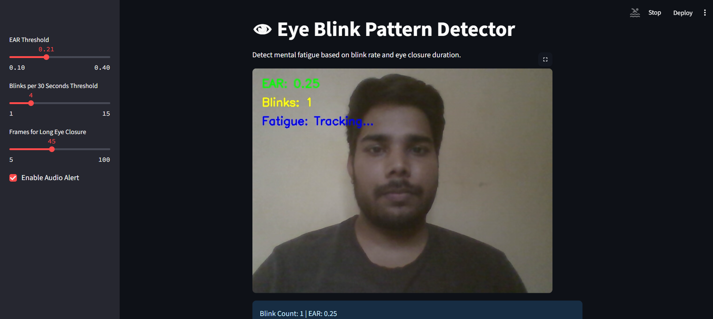

# 👁️ Eye Blink Pattern Detection for Mental Fatigue

This project uses webcam input to detect mental fatigue by tracking eye blinks and eye closure duration using the Eye Aspect Ratio (EAR). It leverages computer vision and rule-based logic to provide real-time fatigue alerts.

---

## 📷 Screenshots

### 1. Live Webcam with EAR and Blink Overlay  

### 2. Fatigue Status and Blink Graph  

---

## 📹 Demo Video

👉 [Click here to watch the demo](https://youtu.be/5D4xDa3DLQc?si=6vP3Qy54Afevk3sO)  

---

## ✨ Features

- Real-time blink detection using MediaPipe FaceMesh  
- EAR (Eye Aspect Ratio) based fatigue classification  
- Displays fatigue status on screen  
- Audio alert when user is drowsy (via `.wav` file)  
- Live graph for blink frequency  
- CSV download of blink and fatigue logs  

---

## 🧠 Tech Stack

- Python 3  
- OpenCV  
- MediaPipe  
- Streamlit  
- NumPy, Pandas  
- HTML (for audio embedding)  

